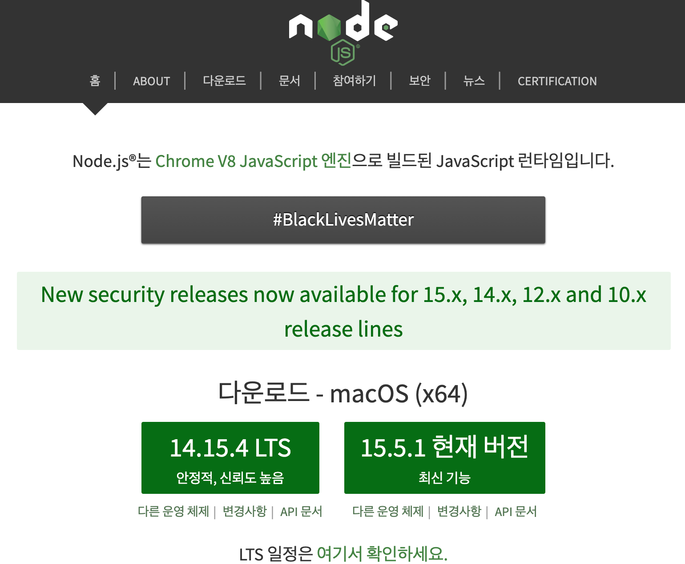

# INDEX

- [공부를 시작한 계기](#nodejs-공부를-시작하게된-계기)
- [Nodejs 설치 / 패키지 매니저(PM2)](#nodejs-설치--패키지-매니저pm2)
- [Nodejs 웹서버 만들기](#nodejs-웹서버-만들기)
- [Nodejs URL 이해](#nodejs-url-이해)
- [Nodejs 파일 읽기 / 파일 목록 확인](#nodejs-파일-읽기--파일-목록-확인)
- [Nodejs 동기 / 비동기 / 콜백](#nodejs-동기--비동기--콜백)

## Nodejs 공부를 시작하게된 계기

- 2학년 2학기 [데이터베이스 수업 프로젝트🔗](https://sonhl0723.github.io/project/db_hotel_web/)를 진행하며 웹 코딩에 눈을 뜨게 되었다.  
배경지식이 하나도 없고 시간도 넉넉하지 않았기 때문에 투자한 시간에 비해 결과물은 형편 없었지만 웹 코딩의 매력을 느꼈다.
웹에 대해 공부를 하고 싶었지만 어떤 것을 학습해야 할지 감이 잡히지 않았고 일단 접한 경험이 있는 `nodejs`에 대해 학습해 보기로 결심했다.

## Nodejs 설치 / 패키지 매니저(PM2)
- 이미 nodejs가 설치되어 있지만 복습할 겸 설치에 대해서 찾아봤다. 
[nodejs.org/ko/](https://nodejs.org/ko/){: target="_blank"}에 들어가면
이러한 화면을 볼 수 있는데 여기서 LTS(Long Term Support-장기간 지원)를 다운받아 주면 된다.
<pre><code>node --version</code></pre>
터미널에 이 명령어를 사용하여 `nodejs`가 잘 설치되었는지 확인 가능하다.
- 생활 코딩 강좌에서는 `PM2`를 사용하여 node 프로세스를 관리하였다. `PM2`를 사용하는 이유가 무엇일까 궁금해서 구글링을 한 결과
로그 처리, 프로세스 재시작 등등 신경써야하는 여러가지 문제점들을 `PM2`로 관리할 수 있기 때문이라는 것을 알았다.
    - PM2 설치
    <pre><code>npm install pm2 -g</code></pre>
    `-g`를 해주는 이유는 글로벌 세팅, 즉 pm2의 명령어를 모든 디렉토리에서 사용가능하게 하기 위해서이다.
    - PM2 시작
    <pre><code>pm2 start main.js</code></pre>
    - PM2 리스트 확인
    <pre><code>pm2 list</code></pre>
    - PM2에 등록된 프로세스 모니터링
    <pre><code>pm2 monit</code></pre>
    - PM2 자동 reloading
    <pre><code>pm2 start main.js --watch</code></pre>
    수정 사항을 저장만 시키면 자동으로 reloading되는 어마어마한 코드다.

## Nodejs 웹서버 만들기

<pre><code>
var http = require('http');
var fs = require('fs');

</code></pre>
- 먼저 이 두 줄의 코드를 이해해 보겠다. Node.js가 내장하고 있는 http 모듈을 로드하기 위해서 `require('http')` 전역함수를 이용한다. 똑같은 흐름으로 Node.js가 내장하고 있는 File System 모듈을 로드하기 위해서 `require('fs')` 전역함수를 이용한다. 두 코드로 인해 하는 http 모듈과 File System 모듈을 사용할 수 있는 것이다.

<pre><code>
var app = http.createServer(function(request,response){
    var url = request.url;
    if(request.url == '/'){
      url = '/index.html';
    }
    if(request.url == '/favicon.ico'){
      return response.writeHead(404);
    }
    response.writeHead(200);
    response.end(fs.readFileSync(__dirname + url));
 
});
app.listen(3000);

</code></pre>
- 이제 웹 서버의 핵심이라고 할 수 있는 나머지 코드이다. node 웹 서버 애플리케이션은 `createServer`를 이용하여 웹 서버 객체를 만든다. 이 app으로 오는 http 요청마다 `createServer`에 전달된 함수가 그 때마다 호출된다는 의미이다. http 요청이 app으로 오면 node가 transaction을 다루기 위해 `request`와 `response` 객체를 전달하며 요청 핸들러 함수를 호출한다. 이러한 요청을 처리하기 위해서는 `listen` 메서드가 객체에서 호출되어야한다. 이 코드에서는 내가 사용하려는 포트 번호인 3000을 `listen`메서드에 전달하였다. 
`request.url` 형태로 url를 호출하게되면 `/디렉토리?id=aaaa` 형태로 받게 된다. 만약 `request.url`이 `/`이면 `/index.html`을 `url`에 넘겨주어 http 상태 코드를 200으로 설정하고 `fs` 모듈을 이용하여 현재 폴더 경로를 나타내는 `__dirname`과 `/index.html`를 결합하여 내 폴더안에 있는 `index.html`을 출력해 준다. `request.url`이 `/favicon.ico`이면 http 상태 코드를 404로 설정해주어 찾을 수 없는 페이지를 요청한다.

## Nodejs URL 이해

> 출처: https://nodejs.org/api/url.html

- nodejs.org에서 제공하는 이미지를 바탕으로 주소값의 어떻게 구성되는지 파악했다. 지금까지 host부분을 건드려줬으니 이제 path부분을 건드리면 경로를 바꿀 수 있겠다는 사실을 깨달았다.

<pre><code>
var url = require('url');

</code></pre>
- `require('url')`로 url 모듈을 로드한다. url 모듈은 url 정보를 객체로 가져와 분석하거나(parse) url 객체를 문자열로 바꿔주는 기능을 수행한다.

<pre><code>
var queryData = url.parse(_url, true).query;

</code></pre>
- <strong>nodejs.org</strong>에서 `url.parse(urlStr, [parseQueryString], [slashesDenoteHost])`를 살펴보면 urlStr를 url 객체로 변환하여 리턴한다고 나와있다. `parseQueryString`과 `slashesDenoteHost`는 `false`가 디폴트 값이다.

> <strong>parseQueryString</strong>
>> true -> url의 query 속성을 객체 형식으로 받아옴.

>> false -> url의 query 속성을 문자열 형식으로 받아옴.

> <strong>slashesDenoteHost</strong>
>> true -> urlStr이 '//foo/bar' 인 경우 foo는 host, /bar는 path로 인식.

>> false -> urlStr이 '//foo/bar' 인 경우 //foo/bar 전체를 path로 인식하고 host는 null로 인식.

이런 배경 지식을 바탕으로 저 코드는 우리가 받아온 url의 query 속성을 객체 형식으로 받아와서 그러한 query 속성을 `queryData`에 지정해 준 것이다. `response.end()`에 `queryData.id`값을 넣어주면 id값이 출력된다.

## Nodejs 파일 읽기 / 파일 목록 확인

<pre><code>
fs.readdir('./data', function(error, filelist));

</code></pre>
- `fs.readdir(path[, options], callback)` 함수를 사용한다. `callback`은 err와 filelist 두 가지의 인자를 갖는다. 여기서 filelist는 '.' , '..'를 제외한 디렉토리 안에 있는 파일 이름의 <strong>배열</strong>이다.

<pre><code>
var list = '&lt;ul&gt;;

while(i < filelist.length){
            list = list + &lt;li&gt; &lt;a href="/?id=${filelist[i]}"&gt;${filelist[i]}&lt;/a&gt;&lt;/li&gt;`;
            i = i + 1;
          }
list = list+'&lt;/ul&gt;';

</code></pre>
- while 문을 사용해서 filelist에 있는 파일 이름들을 `/?id={filelist[i]}`로 파일 리스트를 생성한다. `<ul>`는 <strong>Unordered List</strong>로 순서가 없는 리스트가 된다. 순서가 있는 리스트를 만들려면 `<ol>`로 바꾸면 된다.

## Nodejs 동기 / 비동기 / 콜백
### 동기(Synchronous)
- 동기적으로 일을 수행한다고 하면 일을 순차적으로 수행하는 것을 말한다. 예를 들어 은행 업무를 기다리는 A와 B가 있다. A는 업무를 끝내는데 10분 걸리고 B는 30초가 걸린다면 B가 먼저 일을 보고 A가 일을 보는 것이 효율적일 것이다. 하지만 동기적으로 일을 수행하기 위해서는 그런 효율성을 하나도 고려하지 않고 순차적으로 일을 수행하는 것이다.
 
`B`라고 적힌 `sample.txt` 파일을 하나 생성한다.

<pre><code>
readFileSync
console.log('A');
var result = fs.readFileSync('syntax/sample.txt', 'utf8');
console.log(result);
console.log('C');

</code></pre>
`readFileSync` 함수를 사용하면 동기적으로 일을 수행하여 'A' 'B' 'C' 가 순서대로 출력된다.

### 비동기(Asynchronous)
-  
<pre><code>
console.log('A');
fs.readFile('syntax/sample.txt', 'utf8', function(err, result){
    console.log(result);
});
console.log('C');

</code></pre>
하지만 `readFileSync` 함수 대신 `readFile` 함수를 사용하면 'A' 'C' 'B' 순서로 출력하게 된다.
 
이런 사실로 보았을 때 `nodejs`는 기본적으로 <strong>비동기적</strong>으로 일을 처리한다는 것을 알 수 있다.

### 콜백(Callback)
- 콜백이랑 개념은 나에겐 너무 생소했다. `생활 코딩` 강좌도 알기 쉽게 설명했지만 너무 무지한 내가 콜백에 대해서 100% 이해하기에는 부족했다. 
- 자바스크립트에서는 변수에 할당된 함수를 함수의 파라미터로 전달할 수 있다. 파라미터로 전달된 함수를 다른 함수의 내부에서 호출되는 것을 `Callback`이라 부른다. 
- 이러한 콜백을 왜 사용하는 것일까? 그 해답을 바로 밑에 나오는 코드의 출처인 한 사이트에서 얻었다.
<pre><code>
mysql.query( ‘select 1’ , function( res ){
    console.log( 2 );
});

mysql.query( ‘select 2’ , function( res ){
    console.log( 3 );
});

console.log( 1 );

</code></pre>
> 출처 : https://medium.com/dream-youngs/callback-%EC%A7%80%EC%98%A5-%EA%B3%BC-%EA%B7%B8-%ED%95%B4%EA%B2%B0-2ab583b7607a

처음 이 코드를 봤을 때 출력이 어떻게 되는지 감을 잡을 수 없었다. 하지만 밑의 코드를 보았을 때는 이해하기 굉장히 쉬웠다.

<pre><code>
const First_func = ()=>{
    mysql.query( 'select 1' , ( res )=>{
        console.log( 2 );
        Second_func();
    });
};

const Second_func = ()=>{
    mysql.query( 'select 2' , ( res )=>{
        console.log( 3 );
    });
};

console.log( 1 );
First_func();

</code></pre>
- 위의 코드를 실행하면 '1' '2' '3'이 순서대로 출력된다. 처음 '1'을 출력하면 첫 번째 함수가 실행되고 첫 번째 함수 내부에서 두 번째 함수가 실행된다. 그렇기 때문에 저러한 결과가 나오는 것이다. 그렇다면 왜 콜백을 사용하는 것일까... 그 이유는 `JavaScript`는 기본적으로 <strong>싱글 스레드</strong>로 동작하는 언어이기 때문에 동적으로 일을 처리하면 효율이 떨어진다. 그렇기 때문에 일을 처리하기 위한 다른 함수를 호출하고 그 일이 완료되면 다시 그 함수를 호출하여 결과 값을 처리하여 효율성을 높이는 것이다.

## 출처
- [생활 코딩](https://opentutorials.org/course/3332){: target="_blank"}
- [Node.js Documentation](https://nodejs.org/dist/latest-v6.x/docs/api/documentation.html){: target="_blank"}

