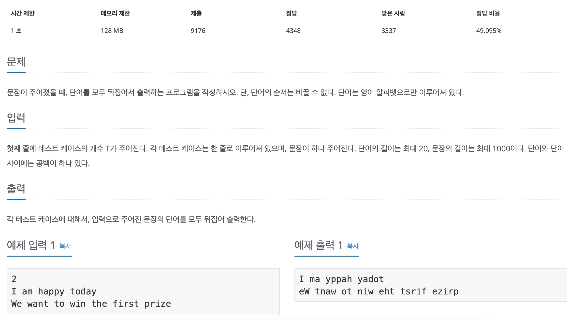

# 문제

- 첫 번째 문장에 테스트 케이스가 주어지고 테스트 케이스마다 받은 문자열을 뒤집어서 출력해주면 되는 문제다.<br>

# 해결 과정
- LIFO(Last In First Out)인 stack을 사용하면 풀릴거 같다.<br>
왜인지 테스트 케이스 변수인 `T`를 받고 엔터를 누르면 `'\n`가 첫 번째 테스트 케이스로 들어갔다.<br>
<pre><code>
cin.ignore();
</code></pre>
그것을 인지하고 방지하기 위해 구글링하여 입력 버퍼를 무시해주는 코드를 알아냈다. getline 함수는 `'\n`를 변수에 담기 때문에 이러한 코드가 필요한 것이다.
<br>

```cpp
#include <iostream>
#include <cstdio>
#include <stack>
#include <vector>

using namespace std;

int main(void){
    ios_base::sync_with_stdio(false);
    cin.tie(NULL);
    cout.tie(NULL);

    int T;
    cin >> T;

    string str, result;

    stack<char> s; // 단어를 뒤집기 위한 수단

    cin.ignore(); // 입력 버퍼 제거
    while(T--){
        getline(cin, str);
        result = "";

        for(int i = 0; i < str.length(); i++){
            if(str[i] == ' '){
                while(!s.empty()){
                    result = result + s.top();
                    s.pop();
                }
                result = result + ' ';
            }
            else{
                s.push(str[i]);
            }
        }

        while(!s.empty()){
            result = result + s.top();
            s.pop();
        }

        cout << result << '\n';
    }

    return 0;
}
```